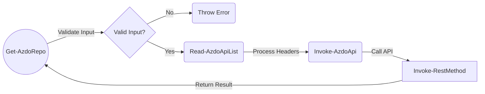

# Module Design

The module is designed... to be modular :). Code that is reused in multiple functions is split into its own function. In most cases, reusable functions aren't intended to be exposed (though this isn't a hard rule).

## General Module Design

Module components are split across folder categories to help with development efforts:

```
Folder Structure
\.helpers
\.vscode
\azuredevops-pwsh-api
\tests
```

#### _.helpers_

Helper scripts that help with the development effort go here. These scripts **are not** packaged and shipped as a part of the module - they exist only for assisting with development efforts.

#### _.vscode_

VSCode specific content (generated by VSCode). This includes defined tasks that help with local development (e.g. running test scripts, or publishing a local version of the module for specific testing).

#### _azuredevops-pwsh-api_

Contains the main module scripts and logic. The .\Scripts subfolder contains the main function logic. Each function has been separated out into its own script (using the same name as the function), allowing for easier changes and more modular approach to unit testing.

#### _tests_

Contains the Pester test scripts.

## Anatomy of a function

All functions that make an Azure DevOps API call have a common scaffolding and follow the same flow:



The steps in this diagram can be summarised as:

## Input Validation

Most of the input validation is handled via parameter declaration (type/input validation/mandatory/optional), with validation happening as the function starts up. Additional validation occurs on the Personal Access Token (PAT):

### Personal Access Token

Each externally-published function checks a Personal Access Token (PAT) is either present or is included as a parameter. The PAT parameter is optional, as the module also supports storing the PAT as an environment variable (`$env:AZDO_PERSONAL_ACCESS_TOKEN`) to save the user from always having to include it. Planned future work will further enhance this functionality.

### Read API List

Supported Azure DevOps API URLs are stored in a configuration file in the module root directory under [azdoapi.json](..\azuredevops-pwsh-api\azdoapi.json). Storing the URLs in a config file (similar to appconfig.json) has the following benefits:
    - Makes it easy to modify the list in a single place (especially if a URL is used in more than one function)
    - Avoids hard-coding of URL values in functions
    - Adds additional flexibility to further decouple the list in the future (if the need arises)

### Invoke-AzdoApi

This is an internal function that serves to standardise the API calls for all invoking functions. It abstracts the formation of the headers, and standardises the authentication type across all functions. This logic would otherwise need to be included in every single function, causing significant duplication.

### Invoking function parameters

With the above in mind, _all_ functions that call into `Invoke-AzdoApi` **must** include the following parameters:

```powershell
    [parameter(Mandatory)]
    [ValidateNotNullOrEmpty()]
    [String]$uri,
    [parameter(Mandatory)]
    [ValidateSet('GET','POST','PUT','DELETE','PATCH')]
    [String]$method,
    [parameter()]
    [String]$requestBody,
    [parameter(Mandatory)]
    [String]$azdoToken,
```
